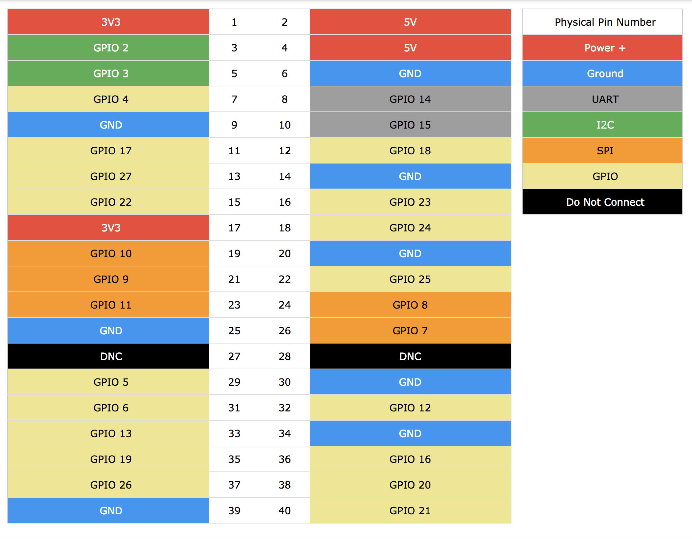
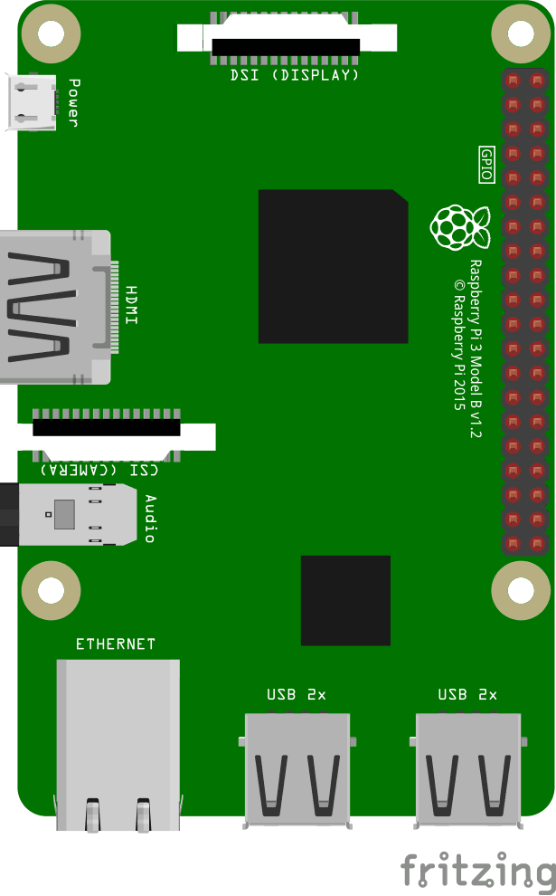

# GPIO Interfacing

Using Raspberry Pi GPIO pins for reading in/out buttons + LEDs

button:
```
const gpio = require('onoff').Gpio;
const button = new gpio(4, 'in', 'both');

button.watch((err, value) => {
    if (err) {
        throw err;
    }
    console.log(value);
});
```

LED:
```
const gpio = require('onoff').Gpio;
const ledR = new gpio(23, 'out');
const ledB = new gpio(18, 'out');

ledR.writeSync(1);
```

## Reference



